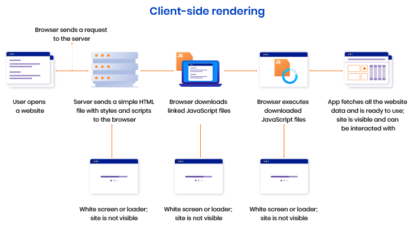
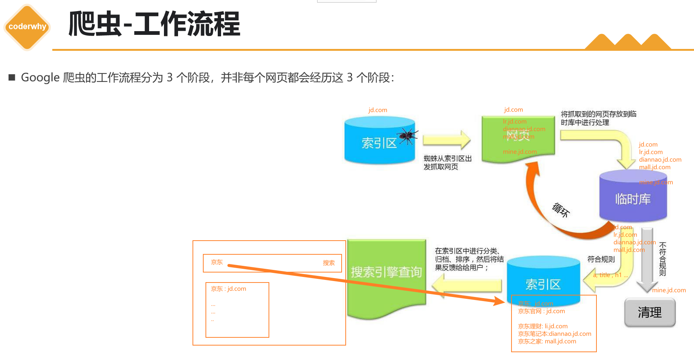

# SPA
1. 单页应用程序 (SPA) 全称是：Single-page application，SPA应用是在客户端呈现的（术语称：CRS）。
 SPA应用默认只返回一个空HTML页面，如：body只有

。
 而整个应用程序的内容都是通过 Javascript 动态加载，包括应用程序的逻辑、UI 以及与服务器通信相关的所有数据。
 构建 SPA 应用常见的库和框架有： React、AngularJS、Vue.js 等。
2. 客户端渲染原理

> 打包后的文件中，html文件body中可能有很多个脚本去引用打包出的bundle.js文件。前端的路由切换，相当于就是执行对应的打包的js代码。

# SPA优缺点
1. SPA的优点
- 只需加载一次：SPA应用程序只需要在第一次请求时加载页面，页面切换不需重新加载，而传统的Web应用程序必须在每次请求时都得加载页面，需要花费更多时间。因此，SPA页面加载速度要比传统 Web 应用程序更快。
- 更好的用户体验
✓ SPA 提供类似于桌面或移动应用程序的体验。用户切换页面不必重新加载新页面
✓ 切换页面只是内容发生了变化，页面并没有重新加载，从而使体验变得更加流畅
- 可轻松的构建功能丰富的Web应用程序
2. SPA的缺点
 SPA应用**默认只返回一个空HTML页面，不利于SEO** （search engine optimization )
 首屏加载的`资源过大时，一样会影响首屏的渲染`
 也不利于构建复杂的项目，复杂 Web 应用程序的`大文件可能变得难以维护`

# 爬虫-工作流程
    Google 爬虫的工作流程分为 3 个阶段，并非每个网页都会经历这 3 个阶段：
1. 抓取：
✓ 爬虫（也称蜘蛛）`，从互联网上发现各类网页，网页中的外部连接也会被发现。`
✓ 抓取数以十亿被发现网页的内容，如：文本、图片和视频
2. 索引编制：
✓ 爬虫程序会分析网页上的文本、图片和视频文件
✓ 并将信息存储在大型数据库（索引区）中。
✓ 例如` <title> 元素和 Alt 属性、图片、视频等`
✓ 爬虫会对内容类似的网页归类分组
✓ 不符合规则内容和网站会被清理
➢ `如：禁止访问 或 需要权限网站等等`
3. 呈现搜索结果：
✓ 当用户在 Google 中搜索时，搜索引擎会根据内容的类型，选择一组网页中最具代表性的网页进行呈现

过程描述：
1. 抓取（Crawling：发现网页 + 下载网页）
- **起点：索引区（已知 URL 集合）**
  - 搜索引擎维护一个“索引区/索引库（一个数据库：存储网址），里面至少包含：
    - 已发现的 URL（以及部分基础信息）
- **蜘蛛从索引区取出 URL 访问网页**
  - 对目标站点发起请求，获取网页内容（HTML 为主，也可能包含图片、视频等资源的引用信息）
- **从网页中提取新链接**
  - 解析 HTML 中的链接（例如 `a` 标签等），把新 URL 收集起来，进入后续队列/临时库
- **循环机制**
  - 新链接会不断被加入待抓取队列，形成“发现 -> 抓取 -> 再发现”的循环

2. 临时库处理（Processing：解析、抽取、规范化）
- **抓取到的网页先进入临时库**
  - 临时库用于对原始网页进行清洗与结构化处理，例如：
    - 解析 DOM 结构，抽取文本内容
    - 抽取关键结构信息：`title`、`h1`、链接文本、图片的 `alt` 等
    - 进行去重（同内容/近似内容、重复 URL 等）
    - 规范化 URL（例如去掉无意义参数等，依实现策略而定）

3. 规则过滤（Filtering：符合规则入索引，不符合清理）
- **符合规则**
  - 内容质量、可访问性、合法性等满足要求
  - 进入“索引编制”流程，写入索引区
- **不符合规则**
  - 进入清理（例如：禁止访问、需要权限、违规/垃圾内容、低质量重复内容等）

4. 索引编制（Indexing：建库、分类、排序准备）
- **把可用信息写入索引区（数据库）**
  - 建立“关键词 -> 页面”的检索结构
  - 进行分类、归档、排序特征构建（为搜索排序提供基础）

5. 搜索呈现（Serving：用户查询 -> 索引检索 -> 返回结果）
- 用户输入关键词后：
  - 搜索引擎在**索引区**检索、排序
  - `将最相关、最具代表性的页面结果返回给用户`

 

有网页，让更多的网页让爬虫爬取