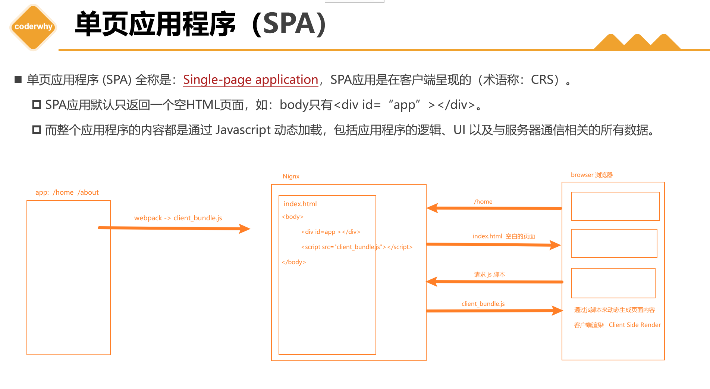
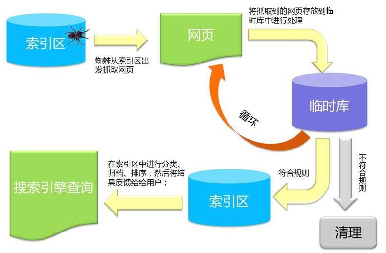
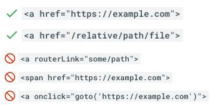
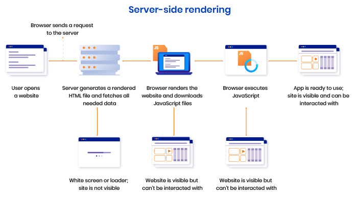

# SPA

1. 单页应用程序 (SPA) 全称是：Single-page application，SPA 应用是在客户端呈现的（术语称：CRS）。
   SPA 应用默认只返回一个空 HTML 页面，如：body 只有

。
   而整个应用程序的内容都是通过 Javascript 动态加载，包括应用程序的逻辑、UI 以及与服务器通信相关的所有数据。
   构建 SPA 应用常见的库和框架有： React、AngularJS、Vue.js 等。
2. 客户端渲染原理
   
   
   > 打包后的文件中，html 文件 body 中可能有很多个脚本去引用打包出的 bundle.js 文件。前端的路由切换，相当于就是执行对应的打包的 js 代码。

# SPA 优缺点

1. SPA 的优点

- 只需加载一次：SPA 应用程序只需要在第一次请求时加载页面，页面切换不需重新加载，而传统的 Web 应用程序必须在每次请求时都得加载页面，需要花费更多时间。因此，SPA 页面加载速度要比传统 Web 应用程序更快。
- 更好的用户体验
  ✓ SPA 提供类似于桌面或移动应用程序的体验。用户切换页面不必重新加载新页面
  ✓ 切换页面只是内容发生了变化，页面并没有重新加载，从而使体验变得更加流畅
- 可轻松的构建功能丰富的 Web 应用程序

2. SPA 的缺点
    SPA 应用**默认只返回一个空 HTML 页面，不利于 SEO** （search engine optimization )
   > 返回一 html 文件，只有各种脚本与样式文件，不利于爬虫，不利于 SEO

 首屏加载的`资源过大时，一样会影响首屏的渲染`
 也不利于构建复杂的项目，复杂 Web 应用程序的`大文件可能变得难以维护`

# 爬虫-工作流程

    Google 爬虫的工作流程分为 3 个阶段，并非每个网页都会经历这 3 个阶段：

1. 抓取：
   ✓ 爬虫（也称蜘蛛）`，从互联网上发现各类网页，网页中的外部连接也会被发现。`
   ✓ 抓取数以十亿被发现网页的内容，如：文本、图片和视频
2. 索引编制：
   ✓ 爬虫程序会分析网页上的文本、图片和视频文件
   ✓ 并将信息存储在大型数据库（索引区）中。
   ✓ 例如` <title> 元素和 Alt 属性、图片、视频等`
   ✓ 爬虫会对内容类似的网页归类分组
   ✓ 不符合规则内容和网站会被清理
   ➢ `如：禁止访问 或 需要权限网站等等`
3. 呈现搜索结果：
   ✓ 当用户在 Google 中搜索时，搜索引擎会根据内容的类型，选择一组网页中最具代表性的网页进行呈现
   
   
   过程描述：
4. 抓取（Crawling：发现网页 + 下载网页）

- **起点：索引区（已知 URL 集合）**
  - 搜索引擎维护一个“索引区/索引库（一个数据库：存储网址），里面至少包含：
    - 已发现的 URL（以及部分基础信息）
- **蜘蛛从索引区取出 URL 访问网页**
  - 对目标站点发起请求，获取网页内容（HTML 为主，也可能包含图片、视频等资源的引用信息）
- **从网页中提取新链接**
  - 解析 HTML 中的链接（例如 `a` 标签等），把新 URL 收集起来，进入后续队列/临时库
- **循环机制**
  - 新链接会不断被加入待抓取队列，形成“发现 -> 抓取 -> 再发现”的循环

2. 临时库处理（Processing：解析、抽取、规范化）

- **抓取到的网页先进入临时库**
  - 临时库用于对原始网页进行清洗与结构化处理，例如：
    - 解析 DOM 结构，抽取文本内容
    - 抽取关键结构信息：`title`、`h1`、链接文本、图片的 `alt` 等
    - 进行去重（同内容/近似内容、重复 URL 等）
    - 规范化 URL（例如去掉无意义参数等，依实现策略而定）

3. 规则过滤（Filtering：符合规则入索引，不符合清理）

- **符合规则**
  - 内容质量、可访问性、合法性等满足要求
  - 进入“索引编制”流程，写入索引区
- **不符合规则**
  - 进入清理（例如：禁止访问、需要权限、违规/垃圾内容、低质量重复内容等）

4. 索引编制（Indexing：建库、分类、排序准备）

- **把可用信息写入索引区（数据库）**
  - 建立“关键词 -> 页面”的检索结构
  - 进行分类、归档、排序特征构建（为搜索排序提供基础）

5. 搜索呈现（Serving：用户查询 -> 索引检索 -> 返回结果）

- 用户输入关键词后：
  - 搜索引擎在**索引区**检索、排序
  - `将最相关、最具代表性的页面结果返回给用户`

# 搜索引擎的优化（SEO）

1. 语义化 HTML 标记-> 核心语义化 HTML 标签规范

- 标题标签

  - 主标题：使用 `<h1>` 标签，**单个页面仅 1 个`<h1>`**，作为页面核心主题标识；
  - 副标题：按内容层级依次使用 `<h2>`~`<h6>`，遵循层级递进原则；
  - 注意：避免过度使用 h 标签，多次使用不会提升 SEO（Search Engine Optimization）效果。

- 基础内容标签
  - 段落：文本内容统一用 `
` 标签包裹；
  - 列表：无序列表使用 `<ul>`，列表项 `<li>` 仅能嵌套在 `<ul>`/`<ol>` 内部，禁止单独使用。

2. 页面基础要求

- 必含要素：每个页面需包含「标题（h 标签） + 内部链接」；
- 页面 title：每个页面配置专属`<title>`标签，不可全站复用同一标题； （可以隐藏掉、加标题目的让爬虫更容易爬取到）
- 内部链接：同一网站所有页面需包含指向首页的内链，提升站点连通性。

3. 链接可抓取性

- 核心要求：确保页面内所有链接格式规范、无访问拦截，可供搜索引擎爬虫正常抓取。
  

4. meta 标签优化
   | 属性名 | 作用 |
   |--------------|----------------------------------------|
   | description | 页面核心描述，展示在搜索引擎结果页 |
   | keywords | 页面核心关键词，提升检索相关性 |

5.文本与图片标记规范

- 文本标记

  - 加粗文本：使用 `<strong>` 或 `<b>` 标签，爬虫会重点关注该类标记的内容；
  - 注意：避免为 SEO 刻意堆砌加粗标签。

- 图片标记
  - `` 标签必须添加 `alt` 属性：
    1. 体验层面：图片加载失败时显示替代文本；
    2. SEO 层面：爬虫读取 alt 内容识别图片核心信息。

6. 爬虫控制与站点地图

- robots.txt 文件（在线生成）

  - 作用：规定搜索引擎爬虫可访问/禁止访问的网站网址，减少无效抓取。

- sitemap.xml 站点地图
  - 作用：列出网站所有网页 URL，确保爬虫完整遍历站点，避免遗漏核心页面。

7. 让更多的网页让爬虫爬取，收集到更多信息：SSR
8. 参考资料
   [Google 搜索文档 - 有效页面元数据](https://developers.google.com/search/docs/crawling-indexing/valid-page-metadata)

9. 核心要点总结

- 语义化标签：`<h1>` 唯一，标签用途匹配内容类型，拒绝滥用；
- SEO 关键配置：`alt`属性、meta 标签、robots.txt/sitemap.xml 是基础；
- 内链与 title：保证站点内链闭环，每个页面配置专属`<title>`。

# 静态站点生成（SSG）

静态站点生成(SSG) 全称是：StaticSiteGenerate，是预先生成好的静态网站。`利于文档、博客网站`
SSG 应用一般在构建阶段就确定了网站的内容。
 如果网站的内容需要更新了，那必须得重新再次构建和部署。
 构建 SSG 应用常见的库和框架有：VueNuxt、React Next.js 等。
◼SSG 的优点：
 访问速度非常快，因为每个页面都是在构建阶段就已经提前生成好了。 直接给浏览器返回静态的 HTML，**也有利于 SEO**
SSG 应用依然保留了 SPA 应用的特性，比如：前端路由、响应式数据、虚拟 DOM 等

◼SSG 的缺点：
 页面都是静态，`不利于展示实时性的内容(网站点击改变内容后数据不能展示出)，实时性的更适合SSR`。
 如果站点内容更新了，那必须得`重新再次构建和部署`。

# 服务器端渲染（SSR）

 构建 SSR 应用常见的库和框架有： Vue Nuxt、 React Next.js 等（SSR 应用也称同构应用） 。

◼ 服务器端渲染原理

- 浏览器访问/home，现象 node 的服务器请求资源，得到一个 html 的字符串
- 拿到这个 html 字符串，开始浏览器渲染。（**渲染完成也是静态页面**）
- 加载 js 脚本，开始水合，完成 ssr

# SSR 优缺点

◼ SSR 的优点
 `更快的首屏渲染速度`
✓ 浏览器显示静态页面的内容要比 JavaScript 动态生成的内容快得多。
✓ 当用户访问首页时可立即返回静态页面内容，而不需要等待浏览器先加载完整个应用程序。
 `更好的 SEO`
✓ 爬虫是最擅长爬取静态的 HTML 页面，服务器端直接返回一个静态的 HTML 给浏览器。
✓ 这样有利于爬虫快速抓取网页内容，并编入索引，有利于 SEO。
 SSR 应用程序在 Hydration 之后依然`可以保留 Web 应用程序的交互性。比如：前端路由、响应式数据、虚拟 DOM 等。`
◼ SSR 的缺点
 SSR 通常需要对服务器进行更多 API 调用，以及在服务器端渲染需要消耗更多的服务器资源，`成本高`。
 `增加了一定的开发成本，用户需要关心哪些代码是运行在服务器端，哪些代码是运行在浏览器端。`
 `SSR 配置站点的缓存通常会比 SPA 站点要复杂一点。`

# SSR 解决方案

SSR 的解决方案（`目的：首页渲染更快，更好的SEO`）：
 方案一：php、jsp ...
 方案二：从零搭建 SSR 项目（ Node+webpack+Vue/React ）
 方案三：直接使用流行的框架（推荐）
✓ React : Next.js
✓ Vue3 : Nuxt3 | | Vue2 : Nuxt.js
✓ Angular : Anglular Universal
◼ SSR 应用场景非常广阔，比如：
 SaaS 产品，如：电子邮件网站、在线游戏、客户关系管理系统（CRM）、采购系统等
 门户网站、电子商务、零售网站
 单个页面、静态网站、文档类网站
 等等
