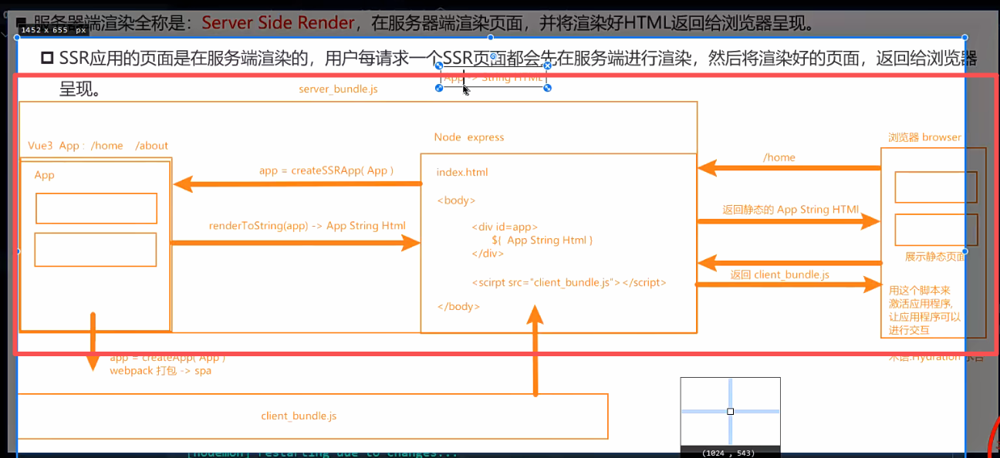

# Vue3 + SSR 搭建 （了解使用了哪些东西）

需安装的依赖项：
 npm i express
 npm i –D nodemon
 npm i vue
 npm i -D vue-loader
 npm i -D babel-loader @babel/preset-env
 npm i -D webpack webpack-cli
 npm i -D webpack-merge webpack-node-externals
◼ vue-loader：加载.vue 文件
◼ webpack-merge： 用来合并 webpack 配置
◼ babel-loader、@babel/preset-env
 加载 JS 文件，转换新语法

- 目前完成：服务端这块，客户端（前端还没做）**只是个静态页面: App.vue 转成一个静态页面**
  
> createSSRApp 把组件转成html字符串

# 跨请求状态污染

在 SPA 中，整个生命周期中只有一个 App 对象实例 或 一个 Router 对象实例 或 一个 Store 对象实例都是可以的，因为每个用户在使用浏览器访问 SPA 应用时，应用模块都会重新初始化，这也是一种**单例模式**。
◼ 然而，在 SSR 环境下，App 应用模块通常只在服务器启动时初始化一次。同一个应用模块会在多个服务器请求之间被复用，而我们的单例状态对象也一样，也会在多个请求之间被复用，比如：
 当某个用户对共享的单例状态进行修改，那么这个状态可能会意外地泄露给另一个在请求的用户。
 我们把这种情况称为：`跨请求状态污染。`
◼ `为了避免这种跨请求状态污染，SSR 的解决方案是：`
 可以在每个请求中为整个应用创建一个全新的实例，包括后面的 router 和全局 store 等实例。
 所以我们在创建 App 或 路由 或 Store 对象时都是使用一个`函数来创建`，保证每个请求都会创建一个全新的实例。
 这样也会有缺点：`需要消耗更多的服务器的资源。`
