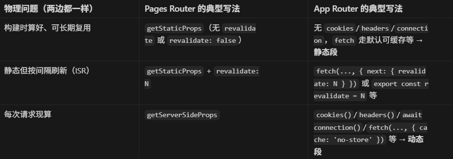

### 服务器渲染策略

- Static Rendering 静态渲染
- Dynamic Rendering 动态渲染
- Streaming 流
  >

### 静态渲染

默认`路由`在构建时，结果将被缓存并可以推送到内容分发网络 （CDN），此优化允许您在用户和服务器请求之间共享渲染工作的结果。

> 这条路由在「可以复用」的前提下生成 HTML/RSC 结果，默认会参与缓存（构建时或按 revalidate 更新），适合 CDN、多用户共享同一份输出。

1. 测试：next dev --turbopack -> next start

- next dev --turbopack：本地开发用的 dev server（带热更新、开发时错误提示等），--turbopack 表示用 Turbopack 做开发时的打包/刷新，一般更快。
- next start：在已经执行过 next build 的前提下，启动生产环境用的 Node 服务，跑的是构建产物，不是开发模式。

### 动态渲染

使用动态渲染时，将在请求时为每个用户呈现**路由**。当路由包含针对用户个性化的数据或包含只能在请求时知道的信息（如 Cookie 或 URL 的搜索参数）时，动态渲染非常有用。

> 每个请求（或每个需要隔离的上下文）再算一遍，和 Cookie、Header、个性化、no-store 的实时数据等有关。

调用动态API：await cookies()、await headers()、await connection() ...

fetch数据：{ cache: 'no-store' }

| **动态API** | **fetch数据** | **渲染情况** |
| ----------- | ------------- | ------------ |
| No          | 缓存          | 静态         |
| Yes         | 缓存          | 动态         |
| No          | 未缓存        | 动态         |
| Yes         | 未缓存        | 动态         |

### connection ：

- 语义是「等真实请求到了再继续渲染」
- 是 next/server 里提供的、专门给 App Router 用的「请求时再往下渲染」开关。在服务器组件里 await connection() 之后，Next 会把这段路由当成 动态渲染：等真实请求进来再继续算后面的 JSX，而不是在构建/预渲染阶段就把结果「钉死」并长期复用。**当前这层路由及子路由都变成动态渲染了：**

1. 作用单位是「路由段」：写在哪个 layout.tsx / page.tsx（或该段里用到的 Server Component）里，主要影响这一段是否参与静态预渲染。
2. 放在 layout 里：该 layout 包裹到的子页面在走这条 layout 时，都会受「这一层已是请求时渲染」的影响（整棵子树在请求路径上更常表现为动态）。
3. 只写在某个 page.tsx 里：主要是这个页面段被标成动态；兄弟段、未经过这段 layout 的别的分支，不一定被变成动态渲染

### Pages Router 对照

> 功能一样：ssg构建时算好、可长期复用;静态但按间隔刷新（ISR）;csr每次请求现算
> 
> 但是概念不一样：Pages Router直接 API控制；APP Router偏向默认与推断

1. 粒度

- Pages：习惯上整页一个 getStaticProps 或 getServerSideProps。
- App：segment（layout / page / 子路由）可以各自带不同信号；还有 RSC、流式、（新版本里）部分预渲染等，边界更细。

2. 默认与推断

- Pages：你不写 GSP/GSSP，行为相对「老几样」、边界清晰。
- App：默认更偏向可缓存/静态推断（例如 fetch 的默认策略随版本有演进），动态要「露」出请求期信号；所以同样「想每请求新鲜」，App 里要主动用 no-store / connection / cookies 等，而不是默认就叫 GSSP。

3. 区别

- Pages：getStaticProps（+ revalidate）≈ 可缓存的静态/ISR；getServerSideProps ≈ 每次请求 的动态。
- App：不再用这两个名字，而是用 段级静态/动态 + fetch 的 cache / revalidate + cookies/headers 等 信号 组合判定。
