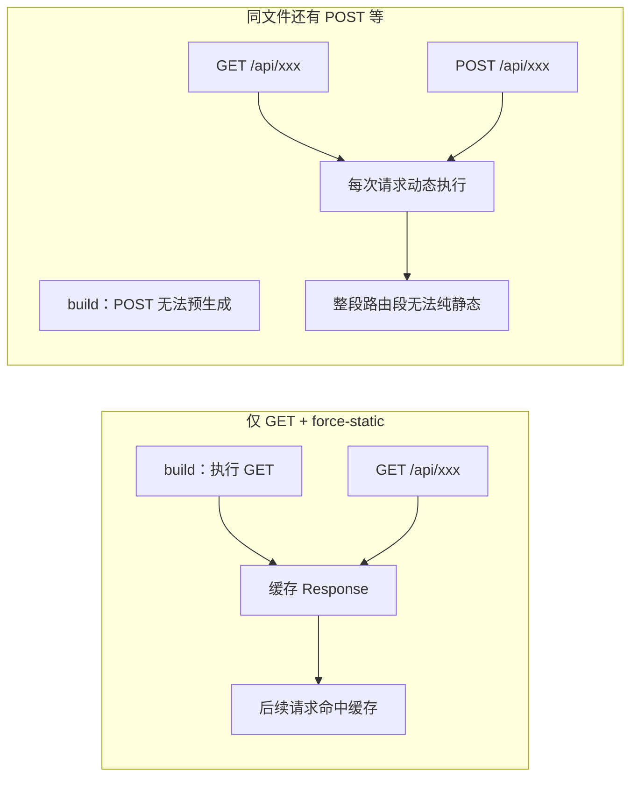

### 请求记忆

记忆化仅适用于 fetch 请求中的 GET 方法，其他方法不会被记忆。不适用于handle route中的fetch请求，因为它们不是 React 组件树的一部分。

- 页面（RSC): SSR/SSG，在 React 组件树 里渲染
  > 打开 http://localhost:3000/api/test?city=beijing，应直接拿到 JSON，而不是 HTML 页面。
  > 在 page.tsx 里对同一 URL 写 3 次 fetch（见你的 09.tsx 注释），看 Network/日志是否只请求一次。
- Route Handler: 纯 HTTP API，不在组件树里

### 请求静态化

1. 指的是handle route中对 GET 请求进行静态渲染，通过`export const dynamic = 'force-static'`，让 GET 在构建期算出响应并走缓存；同文件里若还导出 POST/PUT 等，这条路由就不能再当「纯静态 GET」，静态化会失效或整段变动态。
2. 请求静态化:

- 构建时（或首次生成时）执行一次 GET 处理函数
- 把返回的 JSON/Response 缓存起来
- 之后很多请求 直接读缓存，不再每次跑你的 GET 逻辑

3. 为什么「有其他方法，静态就不起作用」？
   Next 的路由段规则：一个 route.ts 是一个 路由段；段里一旦出现 动态能力（非 GET、或 request.json()、cookies() 等），整段往往不能再按「纯静态 GET API」优化，force-static 对 GET 的意图会被抵消或降级。

4. 你可以怎么验证
   实验 A：纯 GET 静态（建议新建 api/posts-static/route.ts，只 export GET + force-static）

- npm run build，看 build 输出里该路由是否标为静态 / ○。
- npm run start，连续请求 GET，看服务端日志：静态成功时 不应每次 都打 console.log。
  实验 B：你现在的 posts2（force-static + POST）

- build 后看该路由是否仍被标为 dynamic。
- 对比只有 GET 的同名配置，体会笔记里「有其他方法就不起作用」。
  实验 C：对比 api/posts

- 多次 GET /api/posts，每次应看到 ---->（动态执行）。
- 与纯静态 GET 的日志/响应头（如 cache-control）对比。
