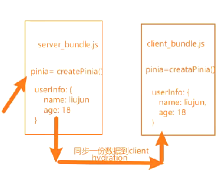

# SSR + Vue Router

1. 注意事项：
    为了避免 跨请求状态污染
    需在每个请求中都创建一个全新 router
2. 路由需要在 node 服务端内存添加路由与注册客户端路由

- [客户端路由](src/router/index.js)
  > 通过函数动态的接收注册的路由类型
  > 注册路由：注意`需要等待路由加载完成,在挂载页面`

```js
import { createApp } from "vue";
import { createWebHistory } from "vue-router";
import App from "../App.vue";
import createRouter from "../router";
import { createPinia } from "pinia";
// spa
let app = createApp(App);

// 安装路由插件
let router = createRouter(createWebHistory());
app.use(router);

// 等待路由加载完成,在挂载页面
router.isReady().then(() => {
  app.mount("#app");
});
```

- [服务端内存添加路由](src/server/index.js)
  > 1. ssrApp 注册路由插件
  > 2. 异步将路由添加到 node 服务内存
  > 3. `等待(异步)路由加载完成,在页面转成字符串`
  > 4. 请求地址设置：server.get("/\*", async (req, res) => {})

# SSR + 状态存储(Pinia)

1. 注意事项：
    为了避免 跨请求状态污染
    需在每个请求中都都创建一个全新 pinia
2. 客户端、服务端都需要注册这个插件：

- [Pinia](src/store/home.js)
- [客户端注册](src/client/index.js)
- [服务端注册](src/server/index.js)
- [使用 Pinia:](src/views/about.vue)
  > storeToRefs: 讲存储的数据转成响应式

3. 客户端、服务端注册的 Pinia 插件初始化的数据怎么同步？
   
   客户端请求页面-> 将服务端对应的 pinia 状态数据 -> 转成 JSON String-> 页面渲染->Hydration-> 挂载到 window.xxx -> 合并服务端的初始化的 pinia 状态数据
