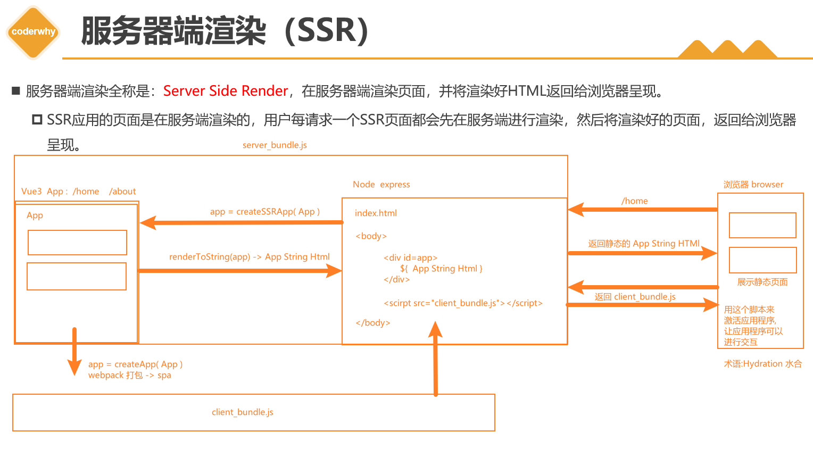

> 简易搭建 react ssr 的流程

# ssr 流程

在 React 中创建 SSR 应用，**需要调用 ReactDOM.hydrateRoot 函数**，而不是 ReactDOM.createRoot
 createRoot ：创建一个 Root，接着调用其 render 函数将 App 直接过载到页面上
 hydrateRoot ：创建水合 Root ，是在激活的模式下渲染 App

> 在激活的模式下渲染 App: 先有个静态的界面，然后加载前端打包资源，激活页面的交互
> 服务器->to string

 服务端可用 ReactDOM.renderToString 来进行渲染的 HTML 字符串。

# Node Server

- [代码](src/server/index.js)
  > ReactDOM.renderToString 将组件转 HTML string
  > StaticRouter 注册服务端路由、路由路径匹配设置 /\*
  > Provider 注册 redux(数据同步逻辑跟 vuex 一样)

> 静态资源路径设置：server.use(express.static("build"));

# 客户端

- [代码](src/client/index.js)
  > redux、router 注册
  > hydrateRoot ：创建水合 Root ，在激活的模式下渲染 App

# Redux Toolkit（RTK）、redux、react-redux 的区别

- 以前在使用 redux 时，通常会将 redux 代码拆分在多个模块中，每个模块需包含多个文件，如：constants、action、reducer、index 等。然后使用 combineReducers 对多个模块合并，这种代码组织方式过于繁琐和麻烦，导致代码量、代码文件过多，也不利于后期管理
  
- 与 react-redux 相比，RTK 有更多的扩展，只需要配置就能使用。
  
