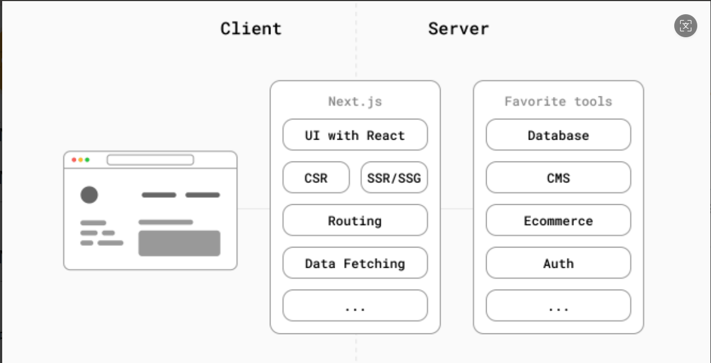
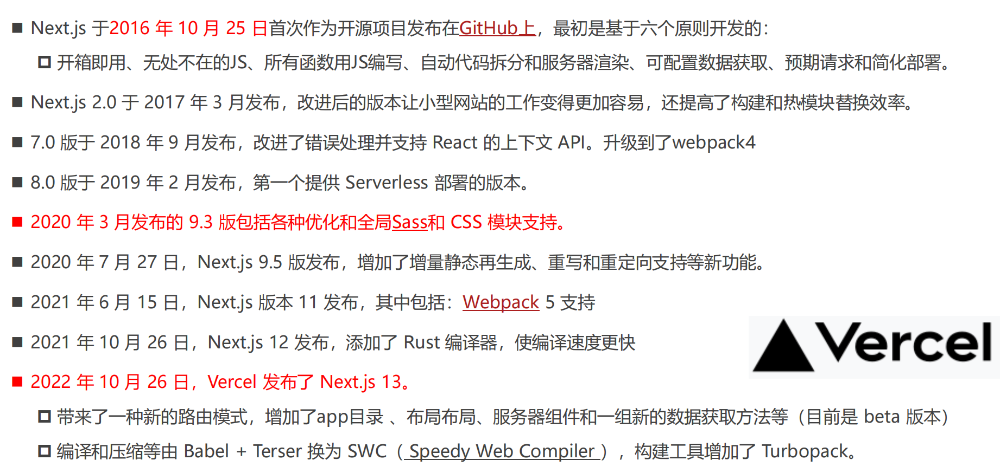
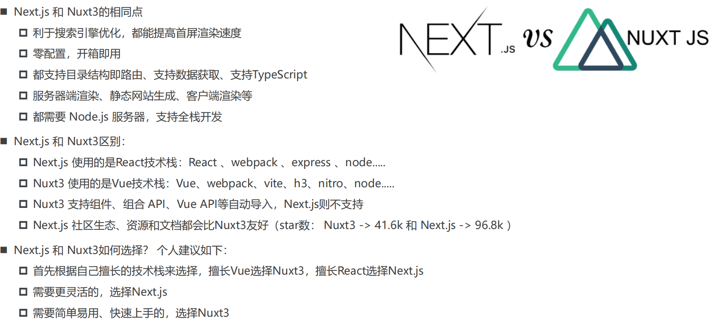

# Next

1. 什么是 Next？
   Next.js 是一个 React 框架，`支持 CSR(客户端渲染、单页面渲染)、SSR(服务器渲染)、SSG(静态站点生成)、ISR (Incremental Static Regeneration)等渲染模式`。
   ◼ Next.js 提供了创建 Web 应用程序的构建块，比如：用户界面、路由、数据获取、渲染模式、后端服务等等
   ◼ Next.js 不但处理 React 所需的工具和配置，还提供额外的功能和优化，比如：UI 构建， CSR、SSR、SSG、ISR 渲染模式，Routing、Data Fetching 等等。
   ◼ 中文官网：https://www.nextjs.cn/docs/getting-started
   ◼ 英文官网：https://nextjs.org/docs/getting-started
   
2. Next.js 发展史
   
3. Next.js 特点
   - 开箱即用，快速创建：
      Next.js 已经帮我集成好了各种技术栈，比如：React、webpack、路由、数据获取、SCSS、TypeScript 等等
      也提供了专门的脚手架：create-next-app
   - 约定式路由（目录结构即路由）
      Next.js 和 Nuxt3 一样，所有的路由都是根据 pages 目录结构自动生成。但在 Next.js 13 beta 版本增加了 app 目录。

- 内置 CSS 模块和 Sass 支持：
   自从 Next.js 9.3 以后就内置了 CSS 模块和 Sass 支持，也是开箱即用
- 全栈开发能力：
   Next.js 不但支持前端开发，还支持编写后端代码，比如：可开发登录验证、存储数据、获取数据等接口
- 多种渲染模式：支持 CSR、SSR、SSG、ISR 等渲染模式，当然也支持混合搭配使用
- 利于搜索引擎优化：
   Next.js 支持使用服务器端渲染，同时它也是一个很棒的静态站点生成器，非常利于 SEO 和首屏

4. Next.js VS Nuxt3
   

# Next.js 目录结构

## 目录结构

> 版本： "next": "13.0.7"

```
01-hello-next     # 项目名称
├─ .eslintrc.json #  eslint配置
├─ next.config.js # 可定制 Next.js 框架的配置，比如:环境变量、重定向、webpack等
├─ package-lock.json #项目依赖库版本的锁定
├─ package.json #项目的描述文件
├─ pages #定义页面文件夹，路由会根据该页面目录结构和文件名自动生成
│  ├─ api # 编写后台接口的文件夹
│  │  └─ hello.ts
│  ├─ index.tsx  #项目的首页
│  ├─ _app.tsx #App组件，应用程序的入口组件
│  └─ _document.tsx   #每个页面的通用配置
├─ public  # 静态资源目录，不参与打包
│  ├─ favicon.ico
│  ├─ next.svg
│  ├─ thirteen.svg
│  └─ vercel.svg
├─ README.md #项目简介
├─ styles #编写样式目录
│  ├─ globals.css  #全局样式，需要在_app.tsx中导入
│  └─ Home.module.css #局部css module样式
└─ tsconfig.json # Typescript的配置文件

```

## 入口 App 组件（\_app.tsx）

- 可以扩展自定义的布局（Layout）
- 引入全局的样式文件
- 引入 Redux 状态管理
- 引入主题组件、三方组件库等等
- 全局监听客户端路由的切换

## ts.config.json 的配置

1. Next.js 默认是没有配置路径别名的，我们可以在 ts.config.json 中配置模块导入的别名：

- baseUrl ：配置允许直接从项目的根目录导入，比如： import Button from 'components/button'
- paths：允许配置模块别，比如： import Button from '@/components/button

  > 注意：如不生效可以重启编辑器

  

> 一般项目配置路径别名需要配置编译器/项目运行的路径别名（ts.config.json）、打包的路径别名（vite.config.js\webpack,config.js 的 resolve.alias）

2. ` 注意`：Next.js 项目一般不需要再单独配“打包工具里的别名”（比如 webpack/vite 里的 alias），因为 Next 会基于 tsconfig.json / jsconfig.json 的 paths 自动处理构建与开发时的解析。
3. `但有几个例外场景要额外配：`

- 你`自定义了` next.config.js 的 webpack 配置，并覆盖了默认解析逻辑
- `项目外工具`（Jest、Storybook、某些 ESLint import resolver）不读 tsconfig，需要各自再配一份别名
- Babel 的 module-resolver 插件单独生效时，也要同步配置
- 所以结论：只针对 Next 打包本身，不用额外配；只配 tsconfig.json 通常就够。

## 环境变量（.env\*）

1. 定义环境变量的 5 种方式：
    .env：所有环境下生效的默认设置
    .env.development：执行 next dev 时加载并生效
    .env.production ： 执行 next start 时加载并生效
    [.env.local](.env.local) ：始终覆盖上面文件定义的默认值。所有环境生效，通常只需一个 .env.local 文件就够了（常用存储敏感信息）
    [next.config.js](next.config.js) 配置 env

> 配置的优先级： next.config.js 中的 env > .env.local > .env

2. 环境变量定义语法（支持变量，例如 $PORT )：
    _大写单词_，多个单词使用下划线，比如：DB\*HOST=localhost
    添加 `_NEXT_PUBLIC_` 前缀会额外暴露给浏览器（浏览器：客户端、服务器都能访问），比如：NEXT_PUBLIC_ANALYTICS_ID=aaabbbccc
3. 环境变量的获取：
    .env 文件中定义环境变量会加载到 process.env 中。两端都可直接通过 process.env.xxx 访问使用（不支持解构）

```js
if (typeof window === "object") {
  console.log("client");
  console.log(process.env.NEXT_PUBLIC_BASE_URL);
} else {
  console.log("server");
  console.log(process.env.NAME);
  console.log(process.env.PORT);
  console.log(process.env.HOST);
  console.log(process.env.NEXT_PUBLIC_BASE_URL);
}
```

4. 注意事项：
    由于 .env、.env.development 和 .env.production 文件定义了默认设置，需提交到源码仓库中。
    而 .env.\*.local 应当添加到 .gitignore 中，因为这类文件是需要被忽略的。

5. 判断运行环境

```js
// 1.判断当前的运行的环境
if (typeof window === "object") {
  console.log("client");
  // console.log(process.server); // Next.js 不支持
} else {
  console.log("server server");
}
```

## Next.js 配置（next.config）

next.config.ts 配置文件位于项目根目录，可对 Next.js 进行自定义配置，比如，可以进行如下配置：

- reactStrictMode: 是否启用严格模式，辅助开发，避免常见错误，例如：可以检查过期 API 来逐步升级
- env：配置环境变量，配置完需要重启
  ✓ 会添加到 process.env.xx 中
  ✓ 配置的优先级： next.config.js 中的 env > .env.local > .env
- basePath：要在域名的子路径下部署 Next.js 应用程序，您可以使用 basePath 配置选项。
  ✓ basePath：允许为应用程序设置 URl 路径前缀。
  ✓ 例如 basePath=/music, 即用 /music 访问首页，而不是默认
- images：可以配置图片 URL 的白名单等信息
- swcMinify: 用 Speedy Web Compiler 编译和压缩技术，而不是 Babel + Terser 技术
- 更多的配置： https://nextjs.org/docs/api-reference/next.config.js/introduction
