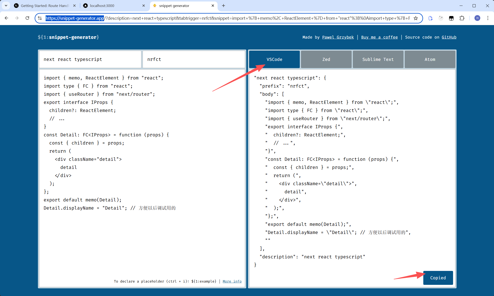
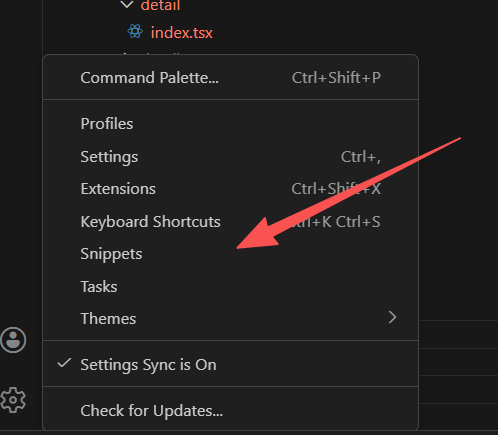
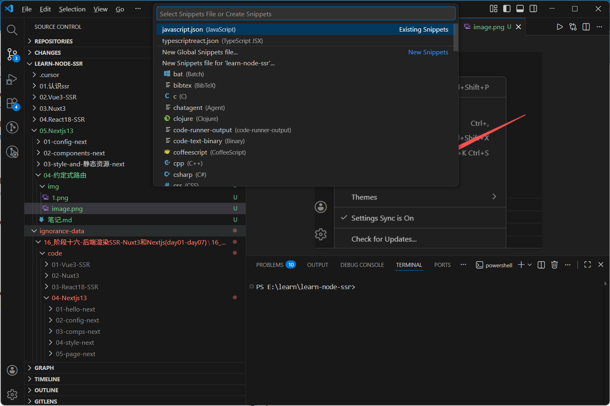

# 设置代码片段

1. 复制代码模板到这个网站： https://snippet-generator.app/



2. File->Preference->Configure Snippet
   

3. 选择自己建立模板的路径
   

4. 设置自己的模板

- 占位符:${1:label},鼠标会自动选中、数字代码选中的顺序、tab 切换
- prefix：触发词

```js
{
	// Place your snippets for typescriptreact here. Each snippet is defined under a snippet name and has a prefix, body and
	// description. The prefix is what is used to trigger the snippet and the body will be expanded and inserted. Possible variables are:
	// $1, $2 for tab stops, $0 for the final cursor position, and ${1:label}, ${2:another} for placeholders. Placeholders with the
	// same ids are connected.
	// Example:
	// "Print to console": {
	// 	"prefix": "log",
	// 	"body": [
	// 		"console.log('$1');",
	// 		"$2"
	// 	],
	// 	"description": "Log output to console"
	// }
	//
	// You can also restrict snippets to specific files using include/exclude patterns:
	// "Test snippet": {
	// 	"prefix": "test",
	// 	"body": "test('$1', () => {\n\t$0\n});",
	// 	"include": ["**/*.test.ts", "*.spec.ts"],
	// 	"exclude": ["**/temp/*.ts"],
	// 	"description": "Insert test block"
	// }
	"next react typescript": {
		"prefix": "nrfct",
		"body": [
			"import { memo, ReactElement } from \"react\";",
			"import type { FC } from \"react\";",
			"import { useRouter } from \"next/router\";",
			"export interface IProps {",
			"  children?: ReactElement;",
			"  // ...",
			"}",
			"const ${1:Home}: FC<IProps> = function (props) {",
			"  const { children } = props;",
			"  return (",
			"    <div className=\"${2:Home}\">",
			"      ${2:Home}",
			"    </div>",
			"  );",
			"};",
			"export default memo(${1:Home});",
			"${1:Home}.displayName = \"${1:Home}\"; // 方便以后调试用的",
			""
		],
		"description": "next react typescript"
	}
}
```

# 约定式路由

1. Next.js `项目页面需在 pages 目录下新建`（ .js, .jsx, .ts, or .tsx ）文件，该文件需导出的 React 组件。
2. Next.js 会根据 pages 目录结构和文件名，来自动生成路由，比如：
    pages/index.jsx → / （首页， 一级路由）
    pages/about.jsx → /about （一级路由）
    pages/blog/index.jsx →/blog （一级路由）
    pages/blog/post.jsx →/blog/post (嵌套路由，一级路由)
    pages/blog/[slug].jsx → /blog/:slug （动态路由， 一级路由）
3. 新建页面步骤：
    1.新建一个命名为 pages/about.jsx 组件文件，并导出（export）React 组件。
    2.接着通过 /about 路径，就可访问新创建的页面了。
4. 注意：Nuxt3 需要添加<NuxtPage>内置组件占位， Next.js 则不需要。但是入口文件\_app.tsx 需要一个类是的 Router-View 的占位组件。
   > [pages/\_app.tsx](pages/_app.tsx):` AppProps.Component 来加载当前路由组件`

# Link 组件/组件导航

1. 组件导航：页面之间的跳转需要用到\<Link\>组件，需从 next/link 包导入。
2. Link 组件底层实现是一个 \<a\> 标签，所以使用 a + href 也支持页面切换（不推荐, 会默认刷新浏览器）
3. Link 组件属性：
    href 值类型（不支持 to）
   ✓ 字符类型： / 、/home、/about
   ✓ 对象类型：{ pathname：’’ , query : { } }
   ✓ URL：外部网址
    as：`在浏览器的 URL 栏中显示的路径的别名, 隐藏真正的路径`
    replace：`替换当前url页面`，_而不是将新的 url 添加到堆栈中_。默认为 false
    target：和 a 标签的 target 一样，指定何种方式显示新页面（Link 跳转外部地址的时候使用）

# 编程导航 (useRouter)

1. Next13 除了`可以通过<Link>组件来实现导航`，同时也支持使用`编程导航`。
2. 编程导航可以轻松的实现动态导航了，缺`点就是不利于SEO。`
   ◼ 我们可以从 next/router 中导入 useRouter 函数（或 class 中用 withRouer），调用该函数可以拿到 router 对象进行编程导航。
3. router 对象的方法：
    push( url [, as , opts] ) ：页面跳转
    replace( url [, as , opts] ) ：页面跳转（会替换当前页面）
    back()：页面返回
    events.on(name, func)：`客户端路由的监听`（建议在\_app.tsx 监听）
   ✓ routeChangeStart
   ✓ routeChangeComplete
    beforePopState ：`路由的返回和前进的监听`。 （建议在\_app.tsx 监听）
    ....

# 动态路由

1. Next.js 也是支持动态路由，`并且也是根据目录结构和文件的名称自动生成`。
2. 动态路由语法：
    页面组件目录 或 页面组件文件都 `支持 [] 方括号语法（方括号前后不能有字符串）。`
   > 目录也可以接收变量
   > 
   >  方括号里编写的字符串就是：动态路由的参数。
3. 例如，动态路由 支持如下写法：
    pages/detail/[id].tsx -> /detail/:id
    pages/detail/[role]/[id].tsx -> /detail/:role/:id
    pages/detail-[role]/[id].tsx -> /detail-:role/:id : 写法错误/detail-[role]/

# 路由参数

1. 动态路由参数
    1.通过 [] 方括号 语法定义动态路由，比如：/post/[id].tsx
    2.页面跳转时，在 URL 路径中传递动态路由参数，比如：/post/10010?name=lcl
    3.动态路由参数将作为查询参数发送到目标页面，`并与其他查询参数合并`

   > 路由/params 参数 -覆盖-> query 参数

    4.目标页面通过` router.query` 获取动态路由参数（注意：Next.js 是 router， Nuxt3 是 route）

```js
const router = useRouter();
const { name, id, age, sex } = router.query;
```

2. 查询字符串参数
    1.页面跳转时，通过查询字符串方式传递参数，比如：/post/10010?name=liujun
    2.目标页面通过 router.query 获取查询字符串参数
    3.如果路由参数和查询参数相同，`那么 路由参数 将覆盖同名的 查询参数。`
