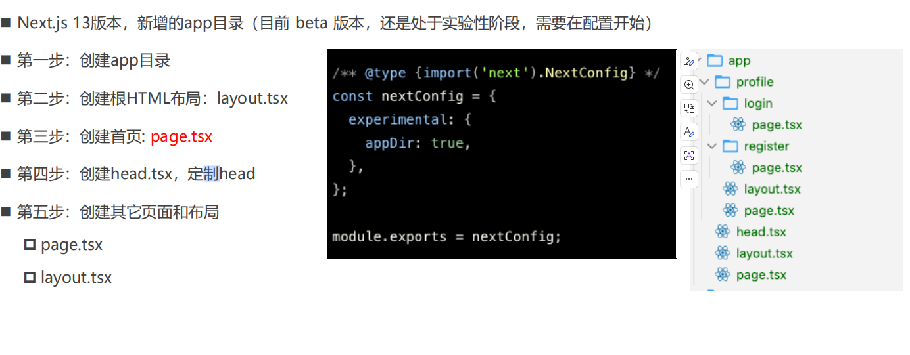

# 布局组件（Layout）

    next版本（13.x.x）

1. 抽离公共布局思路

- 在 [\_app.tsx](01-layout-next/pages/_app.tsx)文件入口中，每个页面的组件都被这个组件的 `props.Component` 接收，`来显示页面内容`；props.Component 可以获取页面组件声明的组件名

2. 嵌套布局->`解决嵌套路由的效果`：
   > 在[\_app.tsx](01-layout-next/pages/_app.tsx)中统一使用布局，往往限制很大，不灵活。

- `所以组件都可以可以单独声明一个 getLayout 函数进行布局`，然后\_app.tsx 中 props.Component.getLayout 接收,从而实现嵌套布局
  > 类型合并使用 &

```jsx
import { ReactElement } from "react";
import type { NextPage } from "next";
import type { AppProps } from "next/app";
// 1. 先Component合并getLayout类型
type NextPageWidthLayout = NextPage & {
  getLayout?: (page: ReactElement) => ReactElement,
};
// 2. 再AppProps合并Component类型
type AppPropsWidthLayout = AppProps & {
  Component: NextPageWidthLayout,
};

export default function App({ Component, ...rest }: AppPropsWidthLayout) {
  const getLayout = Component.getLayout
    ? Component.getLayout
    : (page: ReactElement) => page;
  return getLayout(<Component {...rest.pageProps} />);
}
```

**缺点**：`相当于还是一级路由，没有真正达到客户端单页面的嵌套路由效果；只是把所有的组件放到对应的页面，达到类似嵌套路由的效果`

# 嵌套路由

1. Next.js 和 Nuxt3 一样，也支持嵌套路由(但是只在 app 目录下)，`也是根据目录结构和文件的名称自动生成`。

2. 嵌套路由实现有两种方案：
    方案一：使用 Layout 布局嵌套来实现`（上面）`
    方案二：使用 Next.js 13 版本，新增的 app 目录（目前 beta 版本/实现性）

   - 目录约定：
     > 1. head.tsx: 全局或者局部设置 html 文件 head 标签的内容
     > 2. page.tsx: 全局或者局部设置每个文件夹的根路由；例如/app/profile/page.tsx,对应路由/profile
     > 3. layout.tsx: 全局或者局部设置根路由的布局组件（类似 Layout 组件）；
     > 4. loading.tsx: 第一次路由页面请求到渲染的过程中会先渲染（类似给异步路由组件添加的 loading：React.Suspense 组件添加骨架屏或者 loading）；

   

# 最新版本实现方式：待学习
