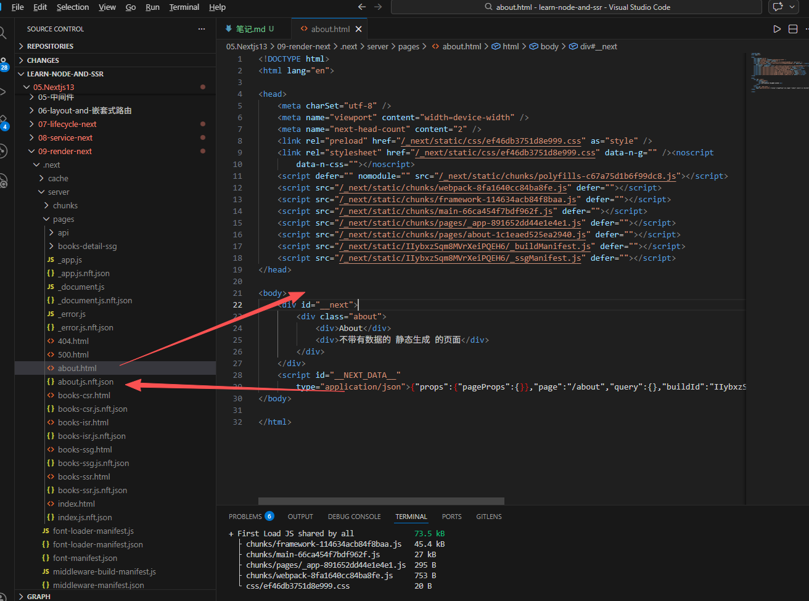
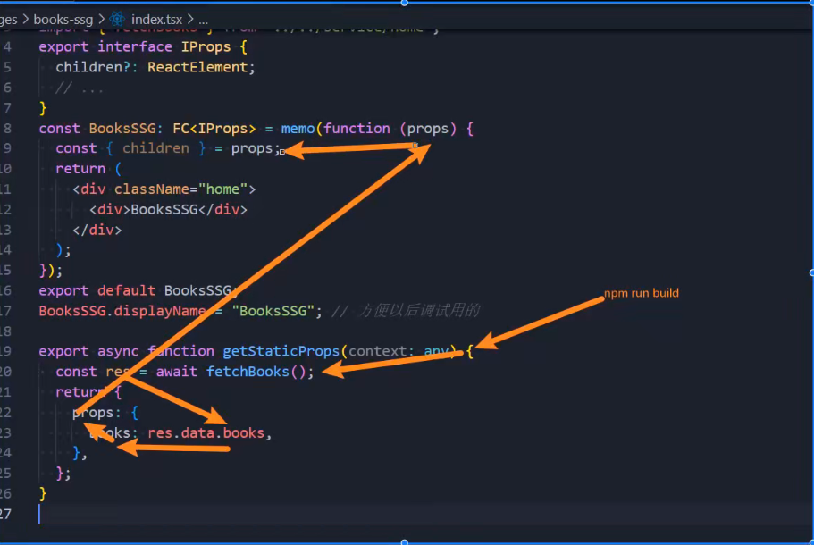
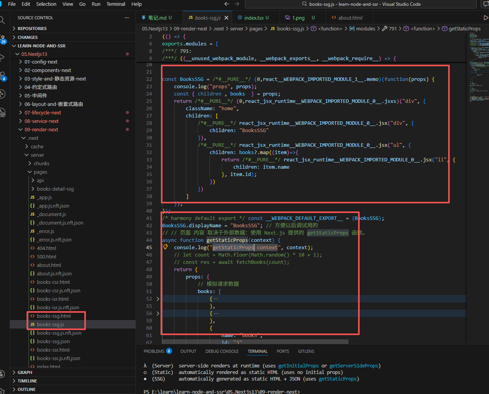
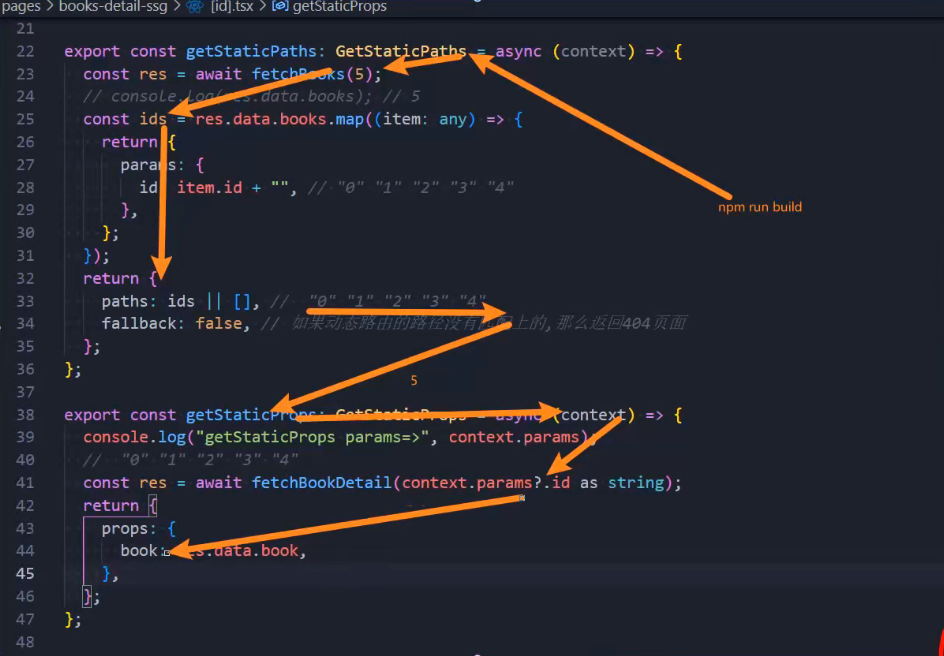
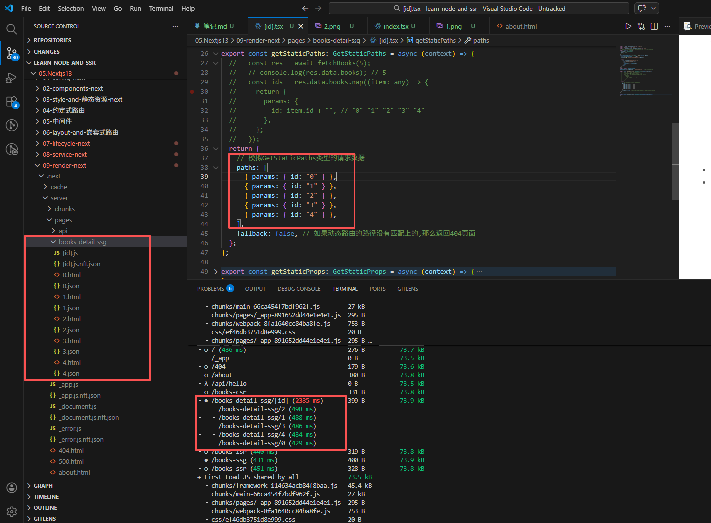

# 预渲染

1. 预渲染

- `默认情况下，Next.js 会 预渲染 每个页面`，即预先为每个页面生成 HTML 文件，而不是由客户端 JavaScript 来完成。
- 预渲染可以带来更好的`性能和 SEO 效果`。
- 当浏览器加载一个页面时，页面依赖 JS 代码将会执行，执行 JS 代码后会激活页面，使页面具有交互性。`(此过程称Hydration)`

2. Next.js 具有两种形式的预渲染

- ` 静态生成/static site generation/SSG （推荐）``：HTML 在 构建时 ` 生成，并在每次页面请求（request）时重用。
- 服务器端渲染/ssr：`在 每次页面请求（request）时 重新生成 HTML页面`。
  > 提示：**出于性能考虑，相对服务器端渲染，更 推荐 使用 静态生成** 。

# 静态生成

> 先要理解 ssr、ssg、单页面客户端渲染的区别，组件在客户端与服务端生命周期的区别，才能理解为啥 ssr、ssg 不在 useEffect 中获取数据。

## 1. 静态生成

也称 SSG/static site generation 或 静态站点生成
 如果一个页面使用了`静态生成，在 构建时`将生成此页面对应的 HTML 文件 。这意味着在生产环境中，运行 next build 时将生成该页面对应的 HTML 文件。然后，此 HTML 文件将在每个页面请求时被重用，还可以被 CDN 缓存。
 在 Next.js 中，你可以静态生成` 带有或不带有数据 的页面`。**接下来我们分别看看这两种情况。**

## 2. 生成不带数据的静态页面

- 默认情况下，Next.js 使用 “静态生成” 来预渲染页面但不涉及获取数据。如下例所示
- 请注意:
  ✓ `此页面在预渲染时不需要获取任何外部数据。`
  ✓ `在这种情况下，Next.js 只需在构建时为每个页面生成一个 HTML 文件即可。`

```js
import { memo, ReactElement } from "react";
import type { FC } from "react";
export interface IProps {
  children?: ReactElement;
}

// 这个是一个:不带有数据的 静态生成 的页面
const About: FC<IProps> = memo(function (props) {
  const { children } = props;
  return (
    <div className="about">
      <div>About</div>
      <div>不带有数据的 静态生成 的页面</div>
    </div>
  );
});
export default About;
About.displayName = "About"; // 方便以后调试用的
```

- npm run build 打包生成的文件
  

## 2. 需要获取数据的静态页面生成

- 当某些页面需要获取外部数据以进行预渲染，通常有两种情况：
  ✓ 情况一：`页面 内容 取决于外部数据`：使用 Next.js 提供的 `getStaticProps` 函数。
  ✓ 情况二：`页面 paths（路径） 取决于外部数据`：使用 Next.js 提供的 `getStaticPaths` 函数（通常还要同时用 `getStaticProps）。`

1. 页面 内容 取决于外部数据

- 比如，发起网络请求拿到页面书籍列表的数据，并展示。具体的使用步骤是：
  ✓ 1.先在 getStaticProps 函数中借助 axios 获取到数据
  ✓ 2.拿到异步数据之后 return 给页面组件
  ✓ 3.页面就可通过 props 拿到数据来渲染页面
  ✓ 4.`在npm run build时，经过以上步骤，一个静态页面就打包生成`
  
- [代码](pages/books-ssg/index.tsx)
- npm run build 打包生成的文件
  
   例如，新建一个动态路由页面，然后发起网络请求拿到书本列表，然后每本书的信息都使用单独详情页面显示。
   `简单的理解就是，在 build 阶段时，动态拿到 n 本书，然后根据 n 书动态生成 n 个静态详情页面。`
  ✓ 1.先在 getStaticPaths 函数中借助 axios 获取到数据,函数返回 GetStaticPaths 类型的对象，`生成多少个对应的路由文件与paths的长度有关`
  ✓ 1.获取到 getStaticPaths 传的值（context.params），在 getStaticProps 函数中借助 axios 获取到数据
  > `执行次数与getStaticPaths返回的值有关（paths的长度）`
  > ✓ 2.拿到异步数据之后 return 给页面组件
  > ✓ 3.页面就可通过 props 拿到数据来渲染页面
  > ✓ 4.`在npm run build时，经过以上步骤，动态路由的静态页面就打包生成` > 、
  > paths 长度为 5，打包生成 5 个静态页面
- [代码](pages/books-detail-ssg/[id].tsx)
- npm run build 打包生成的文件
  

2. 页面 `paths（路径）` 取决于外部数据
   SSG：static site generation
   npm run build -> 执行 getStaticProps -> 生成页面
   执行 getStaticProps 想要获取新的数据必须重新打包

# 静态生成应用场景

1. 建议尽可能使用**静态生成（无论有 与 没有数据）**，**因为静态生成的页面可以构建一次，并可由 CDN 提供服。**
2. 我们可以为多种类型的页面使用静态生成，包括：
    营销页面、官网网站
    博客文章、投资组合
    电子商务产品列表、帮助和文档
3. 如果在用户请求之前就可以预渲染页面，那么应该选择静态生成。反之，静态生成就不合适了。
   > 例如，页面要显示经常更新的数据，并且页面内容会在每次请求时发生变化，这时可以这样选择：

- **静态生成与客户端数据获取(单页面渲染)结合使用：**
  ✓ 我们可以跳过预呈现页面的某些部分，然后使用客户端 JS 来填充它们，但是客户端渲染是不利于 SEO 优化的，例如：
  ➢ 在 useEffect 中获取数据，在客户端动态渲染页面。
- **服务器端/ssr 呈现（也称动态呈现）：**
  ✓ Next.js 会根据每个请求预呈现一个页面。缺点是稍微慢一点，因为页面无法被 CDN 缓存，但预渲染页面将始终是最新的。
