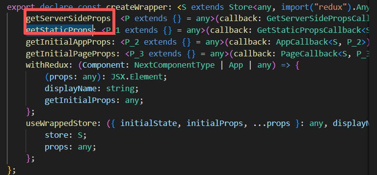
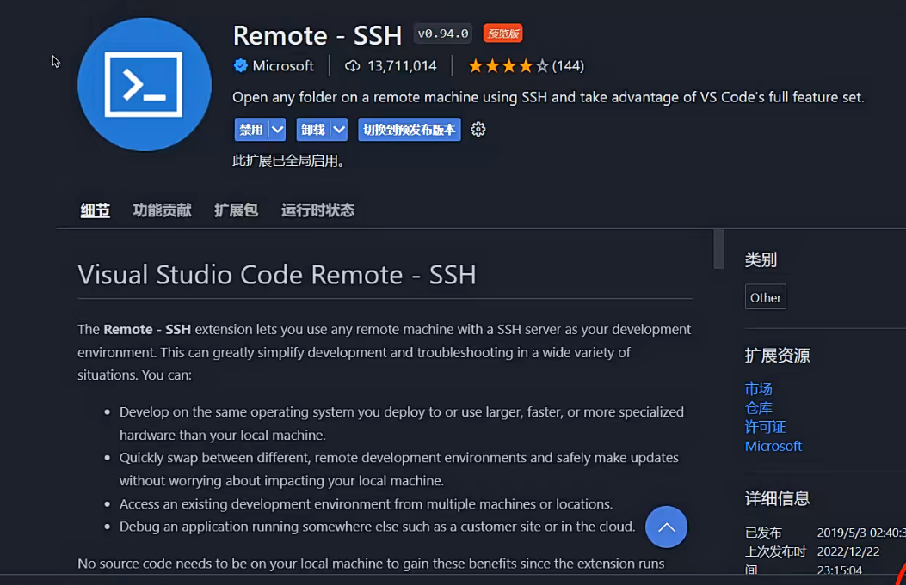
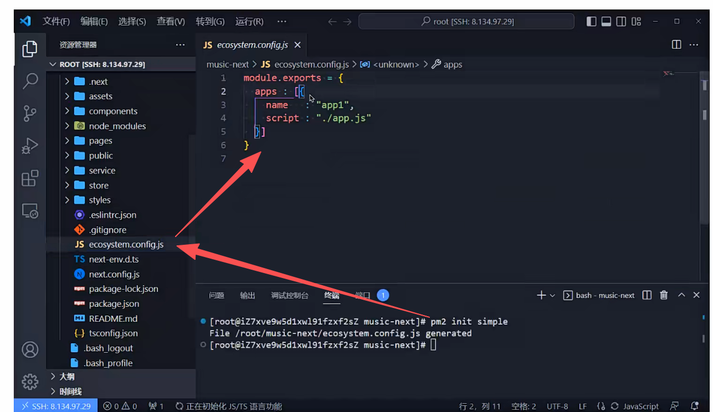
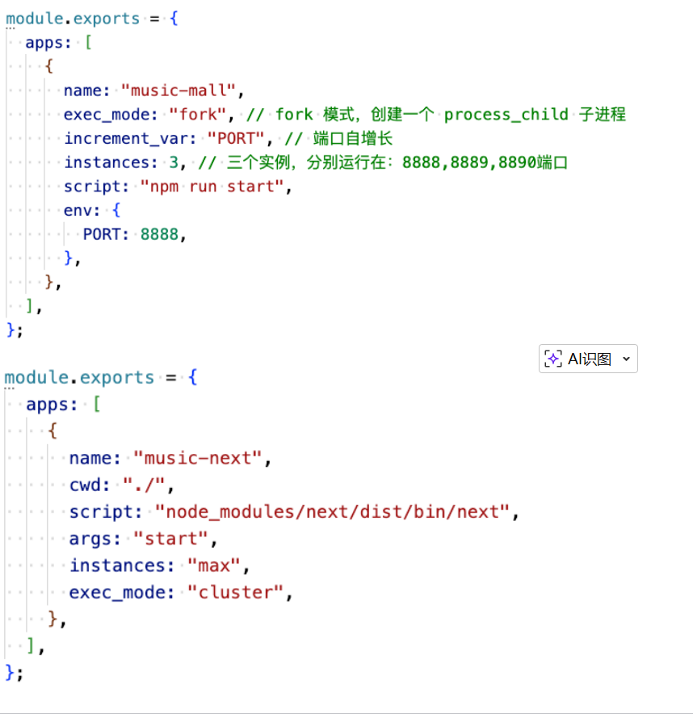
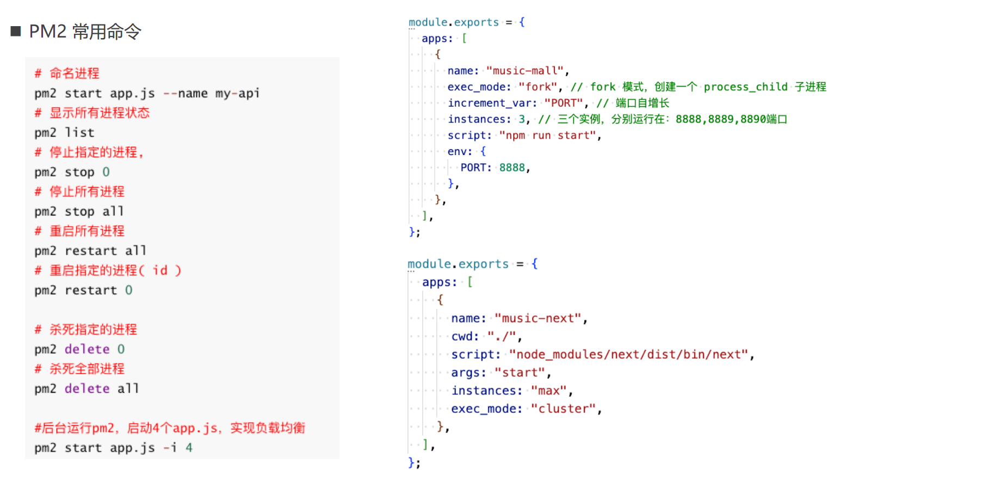

# 项目

1. 引入 css variables， \_app.tsx 引入全局变量
2. 编写公共的\_document.tsx 文件
3. 安装 reduxjs-toolkit **（跟单页面项目有点不一样）**
4. 安装 ui 库 ant、axios。(跟单页面项目一样)

# Next.js 集成 Redux

1. 安装依赖库
    npm i next-redux-wrapper --save
   - 地址：https://github.com/kirill-konshin/next-redux-wrapper
     ✓ 可以避免在访问服务器端渲染页面时 store 的重置
     ✓ 该库可以将服务器端 redux 存的数据，同步一份到客户端上
     ✓ 该库提供了 HYDRATE 调度操作
     ➢ **当用户访问动态路由或后端渲染的页面时，会执行 Hydration 来保持两端数据状态一致**
     ➢ **wrapper 会提供 getServerSideProps、getStaticProps 等** API.比如：每次当用户打开使用了 getStaticProps 或 getServerSideProps 函数生成的页面时，HYDRATE 将执行调度操作。例如[代码](pages/index.tsx)
     
      npm i @reduxjs/toolkit react-redux --save
2. 创建 counter 模块的 reducer：
   > `注意：extraReducers中加上Hydrate的操作, 保证服务端端和客户端数据的一致性`

```js
import { getSearchSuggest } from "@/service/home";
import { createSlice, createAsyncThunk } from "@reduxjs/toolkit";
import { HYDRATE } from "next-redux-wrapper";
import type { ISearchSuggest } from "@/service/home";
// home 模块的state的类型
export interface IHomeInitialState {
  counter: number;
  navbar: ISearchSuggest;
}

const homeSlice = createSlice({
  name: "home",
  initialState: {
    counter: 10,
    navbar: {},
  } as IHomeInitialState,
  reducers: {
    increment(state, { type, payload }) {
      console.log("increment=>", type, payload); // increment=> home/increment 2
      state.counter += payload;
    },
  },
  extraReducers: (builder) => {
    // Hydrate的操作, 保证服务端端和客户端数据的一致性
    builder
      .addCase(HYDRATE, (state, action: any) => {
        // state -> initialState
        // action.payload -> rootState
        return {
          ...state,
          ...action.payload.home,
        };
      })
      // 监听fetchSearchSuggest这个异步action的fulfilled状态, 拿到搜索建议的数据并存到redux中
      .addCase(fetchSearchSuggest.fulfilled, (state, { payload }) => {
        state.navbar = payload;
      });
  },
});
// 异步的action
export const fetchSearchSuggest = createAsyncThunk(
  "fetchSearchSuggest",
  async () => {
    // 发起网络请求,拿到搜索建议的数据
    const res = await getSearchSuggest();
    return res.data;
  }
);

// 同步的action
export const { increment } = homeSlice.actions;
export default homeSlice.reducer;


```

3. store 的创建
   > `注意：创建的store，要被createWrapper包裹，并且使用函数创建->() => store`

```js
import { configureStore } from "@reduxjs/toolkit";
import { createWrapper } from "next-redux-wrapper";
import homeReducer from "./modules/home";
const store = configureStore({
  reducer: {
    home: homeReducer,
  },
});

const wrapper = createWrapper(() => store);
export default wrapper;

// 这个是dispatch函数的类型
export type IAppDispatch = typeof store.dispatch;
// 这个是rootState的类型
export type IAppRootState = ReturnType<typeof store.getState>;
```

4. store 接入应用 鱼使用

- \_app.tsx 中将 store 接入应用
- 使用没有什么不同：还是使用 useSelector、useDispatch

```js
// 全局样式
import "normalize.css";
import "antd/dist/reset.css";
import "@/styles/globals.scss";
import { Provider } from "react-redux";
import wrapper from "@/store/index";
import Layout from "@/components/layout";
import type { AppProps } from "next/app";

export default function App({ Component, ...rest }: AppProps) {
  // Redux 接入的 App
  const { store, props } = wrapper.useWrappedStore(rest);
  return (
    <Provider store={store}>
      <Layout>
        <Component {...props.pageProps} />
      </Layout>
    </Provider>
  );
}
```

# 部署项目

1. 项目打包

- 执行 npm run build `（整个项目是部署产物）`
- 执行 npm run start 本地预览效果
- 类似 FinalShell：

  > **除了 gitignore 忽略的文件，例如 node_modules。全部上传服务器**

  

2. 服务器环境安装：nodejs npm pm2
3. 使用 Node 部署：指定端口： PORT=9090 npm run start （推荐）
4. 使用 PM2 部署（推荐）

- 项目根目录运行： pm2 start npm --name ”music-mall" -- run start
  ✓ pm2 start npm ：在当前目录执行 npm
  ✓ --name ：指定应用程序的名称
  ✓ -- ：后面所有参数会传递给 npm 程序
-  OR： pm2 start “PORT=9090 npm run start” –-name music-mall

5. pm2 的常用配置

- simple 配置
  
  配置信息
  
- 命令配置
  
